# CS5330: Real-Time 2D Object Recognition

**Course:** Pattern Recognition and Computer Vision  
**Tech:** C++ · OpenCV · ONNX Runtime · ResNet18 · IP Webcam

---

## Overview

A real-time 2D object recognition system that identifies objects placed on a flat white surface using a downward-facing mobile camera streamed via IP Webcam. Recognition is **translation, scale, and rotation invariant** — objects are correctly identified regardless of how they are positioned or oriented.

The pipeline implements two parallel classification systems and benchmarks them against each other: a hand-crafted geometric feature classifier (K-NN) and a one-shot deep learning embedding classifier (ResNet18).

---

## Demo

▶️ [Watch the system in action](https://drive.google.com/file/d/1aYV7b2gyIGyhjtFZRw7sr0HbMhCgIUUf/view?usp=sharing)

---

## Pipeline

```
Live Camera Feed
      │
      ▼
ISODATA Thresholding (HSV)
      │
      ▼
Morphological Cleaning (open + close)
      │
      ▼
Connected Components Analysis
      │
      ▼
Feature Extraction (per region)
      │
      ├──────────────────────────────────┐
      ▼                                  ▼
Hand-Crafted K-NN Classifier     ResNet18 Embedding Classifier
(5 geometric features)           (512-dim vector, SSD matching)
      │                                  │
      ▼                                  ▼
  Label (green)                      Label (yellow)
```

---

## Pipeline Stages

### Stage 1 — Thresholding

<p align="center">
  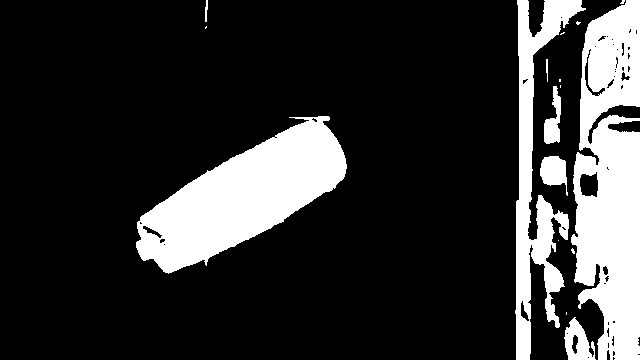
  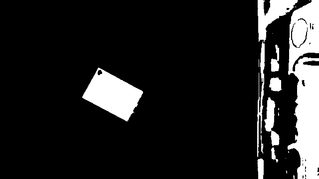
  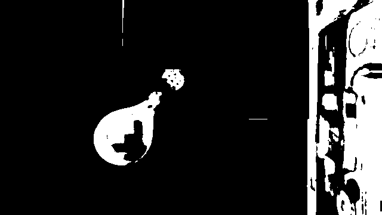
</p>

*Original → Blurred → Binary threshold for pouch, hard disk, and vessel*

A **dynamic ISODATA algorithm** finds the threshold by locating the midpoint between the two dominant brightness clusters in the HSV color space. Gaussian blur is applied first to reduce noise and create more uniform regions.

### Stage 2 — Morphological Cleaning

Morphological **opening** (erosion → dilation) removes small noise blobs. **Closing** (dilation → erosion) fills holes in object silhouettes. Border-touching regions are filtered out.

### Stage 3 — Connected Components Segmentation

<p align="center">
  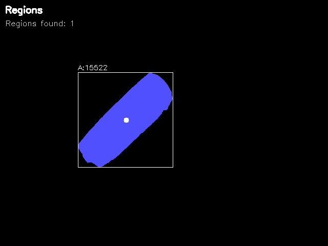
  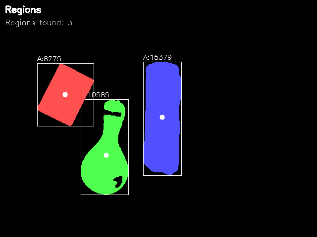
</p>

*Left: single object segmented as one region. Right: three objects each assigned a distinct color.*

`connectedComponentsWithStats` labels each foreground blob with a unique region ID. Regions below a minimum area threshold are discarded as noise. Valid regions are assigned distinct colours with a centroid dot and bounding box overlaid.

### Stage 4 — Feature Extraction

<p align="center">
  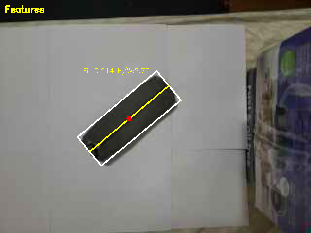
  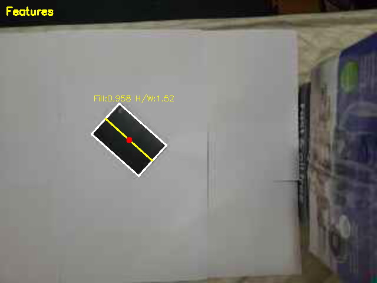
  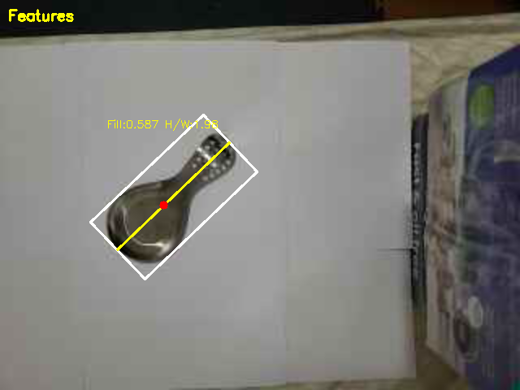
</p>

*Yellow line = axis of least central moment. White box = oriented bounding box. Red dot = centroid.*

Five rotation/scale/translation-invariant features are computed per region:

| Feature | Description |
|---------|-------------|
| H/W Ratio | Height to width ratio of oriented bounding box |
| Percent Filled | Fraction of bounding box area occupied by the object |
| Eccentricity | How elongated the shape is (circle = 0, line = 1) |
| Hu Moment H1 | First rotation-invariant moment |
| Hu Moment H2 | Second rotation-invariant moment |

---

## Classification Systems

### System 1 — Hand-Crafted K-NN (Scaled Euclidean Distance)

<p align="center">
  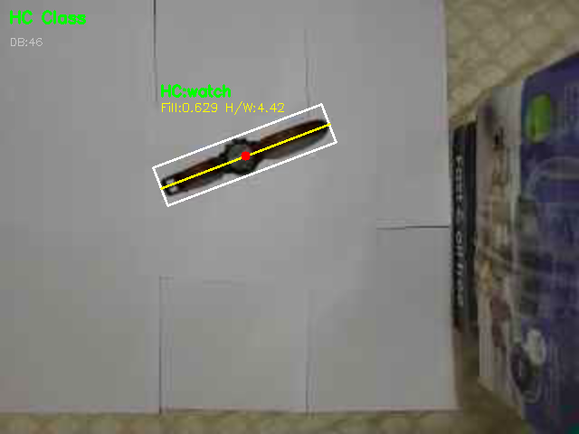
</p>

The five geometric features are scaled by their standard deviations and matched against stored training samples using scaled Euclidean distance. The nearest neighbour label is assigned. Objects with a distance above a threshold are flagged as **"unknown"** in red — enabling open-set rejection.

**Result: 100% accuracy** across 15 test samples (5 classes × 3 samples each).

### System 2 — One-Shot ResNet18 Embedding Classifier

<p align="center">
  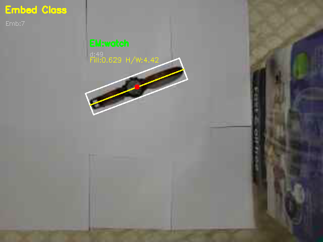
</p>

Each detected region is:
1. Rotated to align its major axis horizontally (removes rotation)
2. Cropped using the oriented bounding box extents
3. Resized to 224×224 pixels
4. Normalized with ImageNet mean/std (0.485, 0.456, 0.406 / 0.229, 0.224, 0.225)

The preprocessed image is passed through a pre-trained **ResNet18 ONNX model**. A **512-dimensional embedding** is extracted from the global average pooling layer (`onnx_node!resnetv22_pool1_fwd`) instead of the final classification head. At runtime, the query embedding is compared against stored embeddings using **sum-squared difference (SSD)**.

**Result: 62.5% accuracy** — primary confusion between hard disk/pouch and vessel/watch, which share similar dark rectangular appearances.

---

## Performance Comparison

<p align="center">
  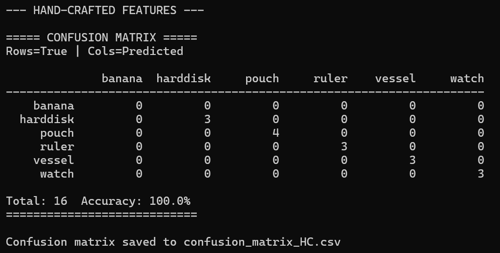
  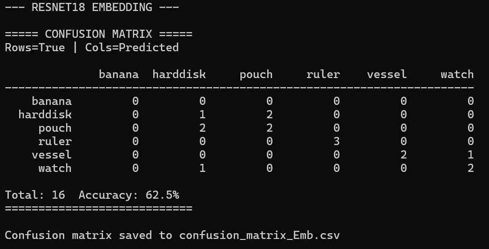
</p>

| System | Accuracy | Notes |
|--------|----------|-------|
| Hand-Crafted K-NN | **100%** | Best for geometrically distinct objects |
| ResNet18 Embedding (one-shot) | 62.5% | Struggles with visually similar dark objects |

> The hand-crafted system outperformed deep learning here because the five objects (hard disk, pouch, ruler, vessel, watch) differ primarily in **geometric shape**, which the invariant features capture completely. The embedding system would be expected to outperform when objects are geometrically similar but differ in texture or colour.

---

## Training New Objects

Press `t` during live video to enter training mode. The console will prompt for a label. The feature vector of the largest detected region is saved as a new row in `training_data.csv`. Collect multiple samples at different positions and rotations to capture natural feature variation.

```
[Console prompt]
Enter label for training sample: ruler
Saved to training_data.csv ✓
```

---

## Prerequisites

- **OpenCV 4.x**
- **C++11 or higher**
- **ONNX Runtime** (for ResNet18 embedding classifier)
- **IP Webcam app** on Android (or any RTSP/HTTP camera stream)
- Visual Studio 2019/2022 (Windows) or CMake (cross-platform)

---

## Build & Run

### Windows (Visual Studio)
```bash
# Clone the repo
git clone https://github.com/yourusername/realtime-2d-object-recognition.git

# Open .sln in Visual Studio
# Set target: x64 Release
# Build > Build Solution (F7)

# Run
cd x64\Release
objectRecognition.exe
```

### Linux / macOS (CMake)
```bash
sudo apt-get install libopencv-dev   # Ubuntu
brew install opencv                   # macOS

mkdir build && cd build
cmake ..
make
./objectRecognition
```

---

## Controls

| Key | Action |
|-----|--------|
| `t` | Train — save current region's features with a label |
| `e` | Evaluate — run confusion matrix on saved test samples |
| `s` | Save current frame images (orig, cleaned, regions, features) |
| `q` | Quit |

---

## Project Structure

```
src/
├── objRecognition.cpp   # Main loop and UI
├── filter.cpp           # Thresholding and morphological ops
├── filter.h
├── features.cpp         # Feature extraction and classification
├── features.h
└── embedding.cpp        # ResNet18 ONNX embedding pipeline

models/
└── resnet18-v2-7.onnx   # Pre-trained ResNet18 (ONNX Model Zoo)

data/
├── training_data.csv    # Hand-crafted feature training database
└── embedding_db.csv     # One-shot embedding database

images/                  # Demo screenshots
```

---

## Keywords

`computer-vision` `object-recognition` `c++` `opencv` `resnet18` `onnx` `real-time` `k-nearest-neighbor` `image-segmentation` `feature-extraction`

---

## Acknowledgements

- Maxwell, B.A. *Fundamentals of Computer Vision* (2022 draft)
- [OpenCV Documentation](https://docs.opencv.org)
- [ONNX Model Zoo — ResNet18](https://github.com/onnx/models)

---
